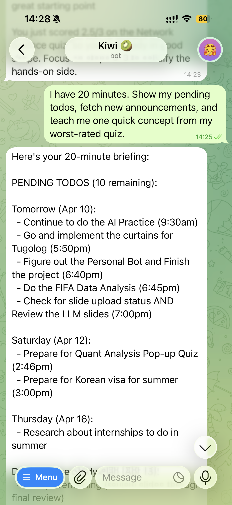
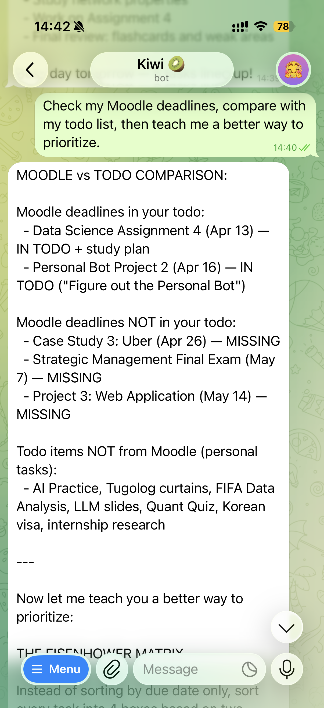

# Personal Bot

A Telegram bot powered by Claude Code (Claude Channels) that acts as a smart personal assistant. 

**Platform:** Telegram  
**Bot username:** **@qauaua_bot**

**How it works:** Claude Code runs locally → Claude Channels routes Telegram messages → custom skills handle requests

---

## Skills

| Skill | Trigger phrases | What it does |
|---|---|---|
| **Moodle Campus Assistant** | "my deadlines", "my courses", "announcements", "setup moodle", "add deadlines to todo" | Fetches live data from AUM's Moodle (online.aum.edu.mn) via browser session cookie |
| **AI Research & Document Summarizer** | "research X", "summarize this", "tell me about X", sends a file | Searches the web or reads uploaded documents and returns a structured summary |
| **Smart Todo Manager** | "add todo X", "list tasks", "done with X", "remove X", "clear done" | Manages a persistent task list stored locally in `data/todos.md` |
| **AI Tutor** | "teach me X", "explain X", "quiz me on X", "lesson on X" | Delivers structured lessons, quizzes, and logs your learning history |

### Skill Chaining

| Chain | How to trigger | What happens |
|---|---|---|
| Moodle → Todo | "add my deadlines to my todo list" | Fetches Moodle deadlines and imports them as tasks |
| Research → Tutor | "research X and teach me" | Searches the web, then builds a structured lesson from the findings |

---

## Example Conversations

**Check deadlines:**
> You: my deadlines  
> Bot: 🟡 *Deep Learning* — 📝 Project 2 — ⏰ Apr 3 (3d away)

**Research and learn:**
> You: research neural networks and teach me  
> Bot: *Neural Networks* — Summary: ... Key Points: ... *(then)* Lesson: What is it?...

**Manage tasks:**
> You: add todo finish README  
> Bot: Added: finish README ✓

**Get a lesson:**
> You: teach me about backpropagation  
> Bot: *Lesson: Backpropagation* — What is it? ...Core Concepts... Check your understanding: [quiz question]

---

## Screenshots

### Multi-Skill Chaining — Todos + Announcements + Teaching


### Moodle-Todo Comparison + Prioritization Lesson


---

## Setup

### Prerequisites

```bash
# GitHub CLI
brew install gh && gh auth login

# Bun (required by Telegram plugin)
curl -fsSL https://bun.sh/install | bash
```

### 1. Create Telegram Bot

1. Open Telegram → search `@BotFather` → send `/newbot`
2. Enter a display name (e.g. "AUM Campus Bot")
3. Enter a username ending in `bot` (e.g. `aum_campus_bot`)
4. Copy the token: `123456789:AAHfiqksKZ8...`

### 2. Clone and Configure

```bash
git clone https://github.com/SDulguun/personal-bot.git
cd personal-bot
```

In a Claude Code session from the project directory:
```
/plugin install telegram@claude-plugins-official
/telegram:configure YOUR_BOT_TOKEN_HERE
```

### 3. Connect Moodle

AUM uses Google OAuth, so the standard REST API token doesn't work. Instead, we use a browser session cookie:

1. Log into **online.aum.edu.mn** in your browser
2. Press **F12** to open DevTools
3. Go to **Application** tab (Chrome) or **Storage** tab (Firefox)
4. Click **Cookies** → **online.aum.edu.mn**
5. Find the cookie named **MoodleSession** and copy its value

Save the session cookie:
```bash
mkdir -p data
echo "YOUR_SESSION_COOKIE" > data/moodle-session.txt
```

> **Note:** The session expires after inactivity or logout. Say "setup moodle" to the bot to refresh it.

### 4. Launch the Bot

```bash
claude --channels plugin:telegram@claude-plugins-official
```

### 5. Pair your Telegram account

1. DM your bot on Telegram — it replies with a 6-character code
2. In your Claude Code session:
```
/telegram:access pair <code>
/telegram:access policy allowlist
```

Your bot is now live and responding.

---

## Project Structure

```
personal-bot/
├── .claude/
│   └── skills/
│       ├── moodle-assistant/SKILL.md    ← Campus assistant (Moodle API)
│       ├── research-summarizer/SKILL.md ← Web research + document summary
│       ├── todo-manager/SKILL.md        ← Persistent task list
│       └── ai-tutor/SKILL.md            ← Lessons, quizzes, learning log
├── scripts/
│   └── moodle_api.py                    ← Python helper for Moodle REST API
├── data/                                ← Gitignored runtime data
│   ├── todos.md
│   ├── moodle-session.txt
│   └── learning-log.md
├── README.md
└── .gitignore
```

---

## Git Workflow

This project used:
- **GitHub issues** — one issue per skill (#2–#5) + setup (#1)
- **Feature branches** — `feature/moodle-assistant`, `feature/research-summarizer`, `feature/todo-manager`, `feature/ai-tutor`
- **Git worktrees** — first 3 skills developed in parallel worktrees simultaneously
- **Pull requests** — each skill merged via PR closing the corresponding issue

---

## Technical Details

- **Platform:** Claude Channels + Telegram Bot API
- **Moodle:** AUM Moodle 4.5.2 at online.aum.edu.mn (browser session cookie — AUM uses Google OAuth)
- **Moodle API functions used:** `core_calendar_get_action_events_by_timesort`, `core_course_get_enrolled_courses_by_timeline_classification`, `mod_forum_get_forums_by_courses`
- **Local data:** todos, learning log, and Moodle session stored in `data/` (gitignored)
